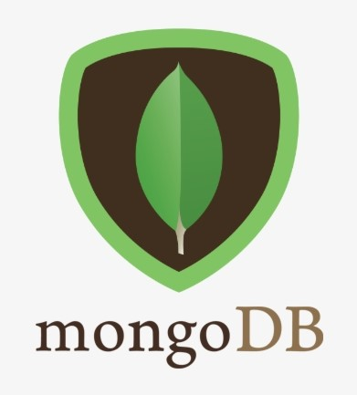
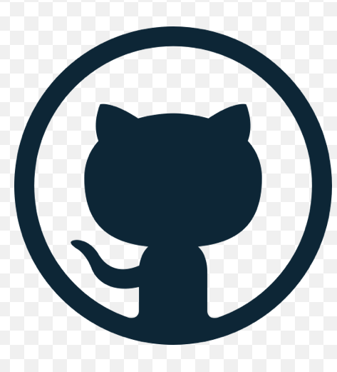
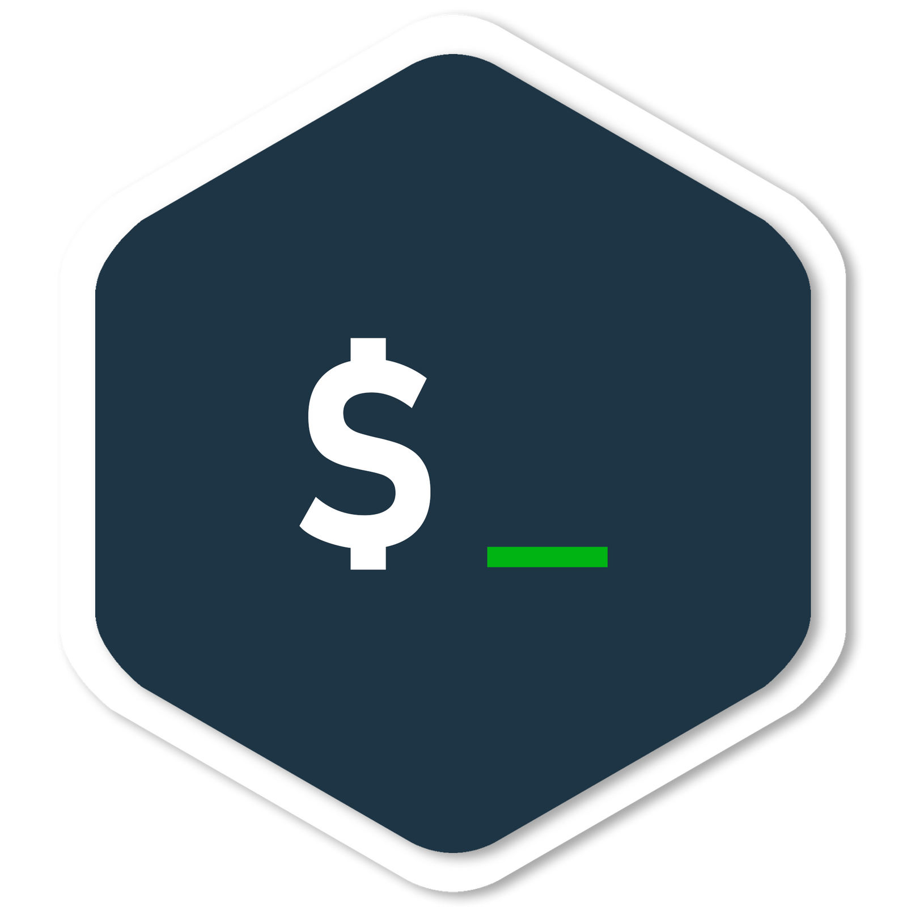

### 👋 Hi, I’m Vaibhav Gupta

## I'm a Student,Developer,Pentester!!
- 👨‍🎓 I'm currently working in a VS Code and learning everytthing
- 👀 I’m interested in programming language,Web and app development, Cyber Security,Database-management-system,Data Science,Dark Web, Cryptography 
- 🌱 I’m currently learning in University Institute of Technology, RGPV Bhopal INDIA.
- 💞️ I’m looking to collaborate with other open source projects
- ⚡ Fun fact: I love to draw, play guitar and support dad at the Hardware shop
<!-- - 👀 I’m interested in programming language,Web and app development, Cyber Security,Database-management-system,Data Science,Dark Web, Cryptography 
- 🌱 I’m currently learning in University Institute of Technology, RGPV Bhopal INDIA. 
- 💞️ I’m looking to collaborate on Cyber Security,Bug bounty,web and app development 
- 📫 How to reach me \\My Email is vaibhavgupta942466@gmail.com 
                     \\My Insta link is https://www.instagram.com/vg._nucleus/?utm_medium=copy_link
                     \\My Linkedin Profile https://www.linkedin.com/in/vaibhav-gupta-337120193/?lipi=urn%3Ali%3Apage%3Ad_flagship3_feed%3B7dsW%2FXq8Q46ty4B2urJ%2FMQ%3D%3D -->
### Connect with me:

[][gmail]
[][linkedin]
[][twitter]
[][instagram]
 

### Languages and Tools:

 

### Self Made Game:

<!---
vaibhavgupta942466/vaibhavgupta942466 is a ✨ special ✨ repository because its `README.md` (this file) appears on your GitHub profile.
You can click the Preview link to take a look at your changes.
--->
 
 

[linkedin]: https://www.linkedin.com/in/vaibhav-gupta-337120193/
[instagram]: https://www.instagram.com/vg._nucleus/?utm_medium=copy_link
[gmail]: mailto:vaibhavgupta942466@gmail.com
[twitter]: https://twitter.com/Vaibhav94246689